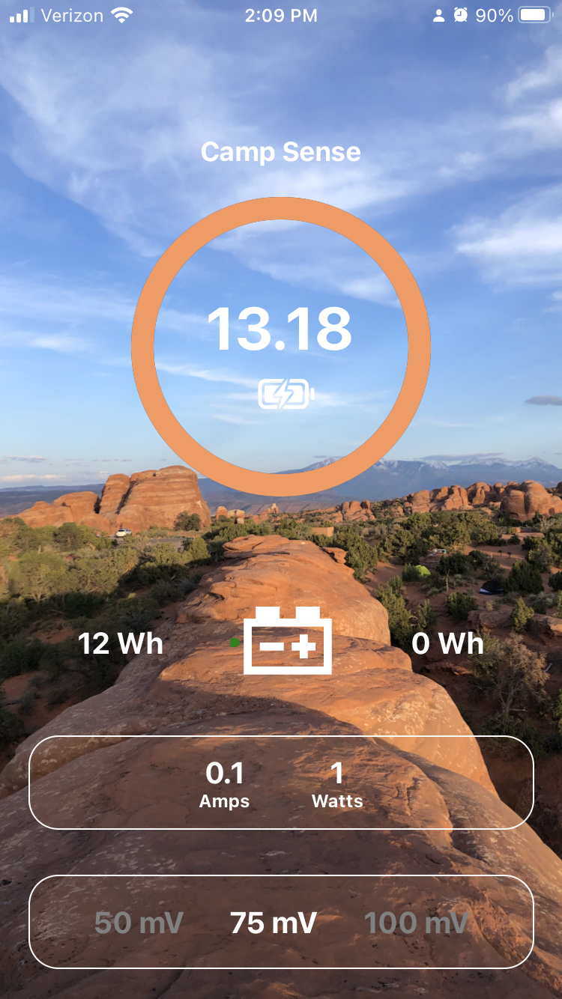
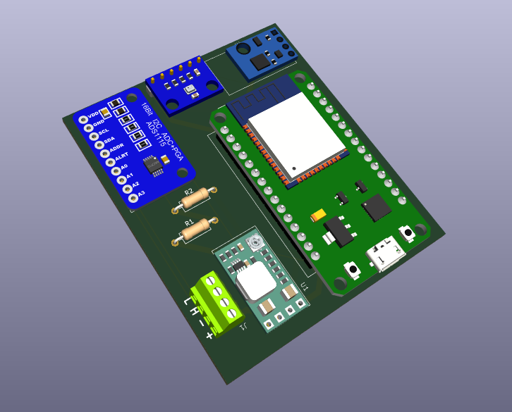
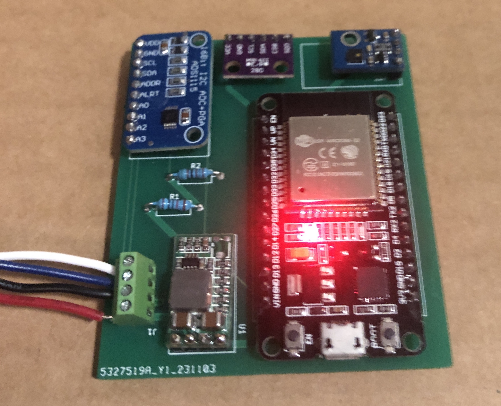
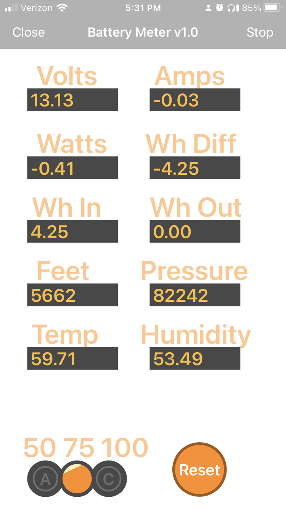

# Camp Sense

Camp Sense connects to WattIsIt via bluetooth and displays the energy and weather data. The `App` folder contains
the React Native app developed using Expo.

|                     Energy                     |                    Weather                    |
| :--------------------------------------------: | :-------------------------------------------: |
|  |  |

# WattIsIT

A battery watt meter using ADS1115 and a shunt to measure power usage. There are 2 Arduino sketches, `Arduino/RemoteXY` and `Arduino/Camp Sense`. The latter uses Platform IO plugin for VSCode and works with the Camp Sense app.

## BOM

AHT21 is optional, was used for humidity but also has a temperature sensor.

| Item           | Link                   |
| -------------- | ---------------------- |
| U2 ESP32       | https://a.co/d/88cG9Z5 |
| M1 ADS1115     | https://a.co/d/gfCO6jt |
| U1 Voltage Reg | https://a.co/d/cpmFpuU |
| U4 AHT21       | https://a.co/d/6xBWBLx |
| U3 BMP280      | https://a.co/d/1HV9oyw |
| J1 Terminals   | https://a.co/d/8nVocXb |
| Shunt          | https://a.co/d/7QWWK5O |
| R1 10k Ohm     | https://a.co/d/6f4wvqz |
| R2 5k Ohm      | https://a.co/d/adCeki6 |

## Version 1.0

|                KiCad Model                |                 In Use                  |
| :---------------------------------------: | :-------------------------------------: |
|  |  |

## Screw Connections

\+ 12 volt + \
\- 12 volt - \
L Low side of shunt \
H High side of shunt

## Remote XY

Before the Camp Sense app Remote XY was used for development. The sketch is in `Arduino/RemoteXY`.

The Remote XY is a free app is used to view data with bluetooh. This also has a setting for the shunt 50, 75, or 100 mV. The setting is persisted in eeprom (flash memory)

https://remotexy.com/en/editor/391325040dffc13fc4e74f019a2b24ee/

